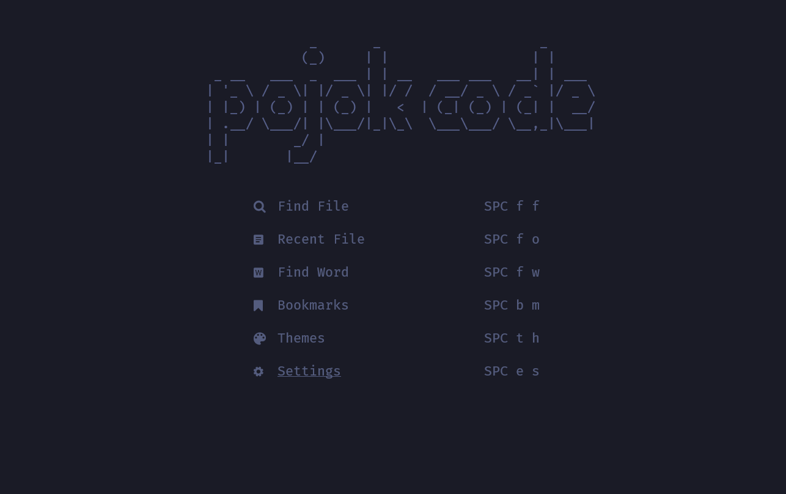

# NvChad-config

## Dashboard



## Kebutuhan dasar

1. Install Neovim 8.0+ https://github.com/neovim/neovim/releases/tag/v0.8.1
2. C++ (windows) Compiler https://www.msys2.org/
3. GIT https://git-scm.com/download/win
4. NodeJs https://nodejs.org/en/
5. Ripgrep https://github.com/BurntSushi/ripgrep
6. Lazygit https://github.com/jesseduffield/lazygit
7. Nerd Font https://github.com/ryanoasis/nerd-fonts
8. Windows Terminal (Windows) https://apps.microsoft.com/store/detail/windows-terminal/9N0DX20HK701?hl=en-id&gl=id
9. Powershell (windows) https://apps.microsoft.com/store/detail/powershell/9MZ1SNWT0N5D?hl=en-id&gl=id

## Config Linux (Linux Debian Based)

- Pastikan Akun Sudah Administrator

```
visudo
[nama user] ALL=(ALL:ALL) ALL
[nama user] ALL=(ALL) NOPASSWD:ALL
```

- Lakukan install Neovim dari link No 1 diatas

```
sudo apt-get install wget
mkdir download
cd download
wget https://github.com/neovim/neovim/releases/download/v0.8.1/nvim-linux64.deb
```

- Check ketersediaan GCC

```
gcc --version
```

- Install git

```
sudo apt-get install git
git --version
```

- Install NodeJS

```
sudo apt-get install curl
sudo apt install build-essential libssl-dev
curl -o- https://raw.githubusercontent.com/nvm-sh/nvm/v0.35.3/install.sh | bash
source ~/.bashrc
nvm install 18.12.1
node --version
npm --version
```

- Install unzip, ripgrep

```
sudo apt-get install unzip
sudo apt-get install ripgrep
```

- Install Lazygit

```
LAZYGIT_VERSION=$(curl -s "https://api.github.com/repos/jesseduffield/lazygit/releases/latest" | grep '"tag_name":' |  sed -E 's/.*"v*([^"]+)".*/\1/')
curl -Lo lazygit.tar.gz "https://github.com/jesseduffield/lazygit/releases/latest/download/lazygit_${LAZYGIT_VERSION}_Linux_x86_64.tar.gz"
sudo tar xf lazygit.tar.gz -C /usr/local/bin lazygit
lazygit --version
```

- Copy Config

```
git clone https://github.com/NvChad/NvChad ~/.config/nvim --depth 1 && nvim
git clone https://github.com/pojokcodeid/NvChad-config.git ~/.config/nvim/lua/custom
```

## Copy Config (Windows)

```
git clone https://github.com/NvChad/NvChad $HOME\AppData\Local\nvim --depth 1 && nvim
git clone https://github.com/pojokcodeid/NvChad-config.git $HOME\AppData\Local\nvim\lua\custom
```

## Plugins dan Sumber Yang Digunakan

| No  | Plugin                        | Link                                             |
| --- | ----------------------------- | ------------------------------------------------ |
| 1   | NvChad                        | https://nvchad.com/                              |
| 2   | better-escape                 | https://github.com/max397574/better-escape.nvim  |
| 3   | Color Scheme                  | https://github.com/folke/tokyonight.nvim         |
| 4   | akinsho/toggleterm.nvim       | https://github.com/akinsho/toggleterm.nvim       |
| 5   | CRAG666/code_runner.nvim      | https://github.com/CRAG666/code_runner.nvim      |
| 6   | rcarriga/nvim-notify          | https://github.com/rcarriga/nvim-notify          |
| 7   | mrjones2014/smart-splits.nvim | https://github.com/mrjones2014/smart-splits.nvim |
| 8   | stevearc/dressing.nvim        | https://github.com/stevearc/dressing.nvim        |
| 9   | folke/todo-comments.nvim      | https://github.com/folke/todo-comments.nvim      |

## Ubah Dashboard

- Cari File nvim/lua/custom/plugins/alpha.lua <br>
  -- Ubah Bagian Code Berikut

```
 val = {
      [[             _       _                    _      ]],
      [[            (_)     | |                  | |     ]],
      [[ _ __   ___  _  ___ | | __   ___ ___   __| | ___ ]],
      [[| '_ \ / _ \| |/ _ \| |/ /  / __/ _ \ / _` |/ _ \]],
      [[| |_) | (_) | | (_) |   <  | (_| (_) | (_| |  __/]],
      [[| .__/ \___/| |\___/|_|\_\  \___\___/ \__,_|\___|]],
      [[| |        _/ |                                  ]],
      [[|_|       |__/                                   ]],
    },

```

- Link Untuk Generate Dashboard <br>
  https://patorjk.com/software/taag/
